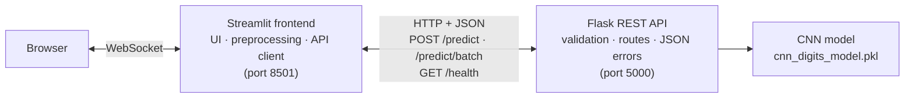

# Streamlit Frontend Integrated with a Flask API

A real-time digit classifier made of **two separate programs**: a **Streamlit frontend** that
collects a digit (pick, draw or upload) and a **Flask REST API** (built in Task 4) that runs the CNN
and answers in JSON. The frontend contains **no model code** — every prediction is an HTTP request.

> **Objective:** To establish communication between frontend and backend components for real-time inference.

**Student:** Shrikant Daulat Nagare · M.Sc. DSBDA – Part 2
**Full report (source code, screenshots, test report):** [`Streamlit_Flask_Integration_Report.pdf`](Task8_Streamlit_Flask_Integration_Report.pdf)

---

## Architecture



**One prediction, step by step**

1. The user picks a sample, draws on the canvas or uploads a photo.
2. Streamlit turns it into an 8×8 image (drawings/photos are cropped, scaled and centred first).
3. `api_client.py` sends `POST /predict` with `{"image": [64 numbers]}` and times the call.
4. Flask validates the body, runs the CNN and returns the digit, confidence and all ten probabilities.
5. Streamlit shows the result, the round-trip time and the raw JSON, and logs the call.

| UI feature | API call |
|---|---|
| Connection status (sidebar, every update) | `GET /health` |
| Predict tab — sample / draw / upload | `POST /predict` |
| Predict tab with test-time augmentation | `POST /predict/batch` (11 variants in one request) |
| Batch test tab | `POST /predict/batch` (up to 100 images) |
| API explorer tab | any request, including deliberately broken ones |

---

## Quick start

```bash
pip install -r requirements.txt            # needs Streamlit 1.53 or newer
```

**Terminal 1 — backend (Flask, port 5000)**
```bash
cd flask_api
python app.py
```

**Terminal 2 — frontend (Streamlit, port 8501)**
```bash
streamlit run frontend/streamlit_app.py
```

Open <http://localhost:8501>. The sidebar shows **API online ✓** once the backend is reachable.
If the API runs elsewhere, change the URL in the sidebar or set `DIGIT_API_URL`.

---

## Features

- **Three input modes:** dataset samples, a drawing canvas, photo upload (with auto-crop and invert).
- **Live results:** predicted digit, confidence band, top-3, probability chart, **round-trip latency**, HTTP status, payload size, and the raw request/response JSON.
- **Test-time augmentation** through the batch endpoint (11 variants averaged).
- **Batch test:** up to 100 images in one request, with accuracy against the true labels.
- **API explorer:** send valid and invalid requests (wrong size, bad JSON, unknown endpoint, wrong method…) and inspect the structured error replies.
- **Request log** of every API call, downloadable as CSV.
- **Graceful failure:** if the API is down the UI says so, shows how to start it and disables *Send*; it reconnects by itself after a restart.

---

## Project structure

```
.
├── flask_api/
│   ├── app.py                    # Flask REST API from Task 4 (unchanged)
│   ├── cnn_digits_model.pkl      # model weights served by the API
│   ├── sample_client.py          # Task 4 command-line client
│   └── README.md                 # Task 4 API reference (endpoints, status codes)
├── frontend/
│   ├── streamlit_app.py          # the Streamlit UI
│   ├── api_client.py             # HTTP client: timing, errors returned as data
│   └── preprocessing.py          # crop → scale → centre, test-time-augmentation variants
├── tests/
│   ├── run_integration_tests.py  # 27 API integration tests (starts Flask itself)
│   ├── e2e_ui_tests.py           # 12 browser checks (Playwright → Streamlit → Flask) + screenshots
│   └── results/                  # test_results.json, ui_test_results.json, server logs
├── docs/screenshots/             # screenshots used below
├── Task8_Streamlit_Flask_Integration_Report.pdf
└── requirements.txt
```

---

## Test results

Run them yourself:

```bash
python tests/run_integration_tests.py      # starts and stops the Flask API automatically
pip install playwright && playwright install chromium
python tests/e2e_ui_tests.py               # starts Flask + Streamlit, drives a real browser
```

| Suite | Result |
|---|---|
| API integration tests (connection, predictions, 11 error cases, faithfulness, accuracy, performance, resilience) | **27 / 27 passed** |
| Browser end-to-end checks (UI → Streamlit → Flask) | **12 / 12 passed** |

**Accuracy measured through the HTTP API**

| Images | Raw 8×8 | After frontend preprocessing |
|---|---|---|
| 270 validation images | 90.74 % | **98.52 %** |
| All 1,797 dataset images | 89.76 % | **98.50 %** |

Preprocessing in the frontend matters: the model was trained on cropped, scaled and centred digits, so skipping that step costs about eight points.

**Faithfulness:** all 1,797 images give identical predictions through the API and directly from the model code (largest probability difference 5·10⁻⁵ = the API's 4-decimal rounding).

**Performance (one machine, localhost, Flask development server)**

| Measurement | Result |
|---|---|
| Single `POST /predict`, 200 sequential calls | median **2.0 ms**, 95th percentile 2.4 ms, max 3.0 ms |
| `POST /predict/batch`, 100 images | 36.1 ms total (0.36 ms per image) |
| 200 requests from 8 parallel clients | 200 / 200 succeeded (411 requests/s) |
| API restart until the next prediction works | 0.41 s |

---

## Screenshots

| | |
|---|---|
| **Connected frontend, real-time prediction**  | **Request and response JSON in the UI**  |
| **Test-time augmentation via `/predict/batch`**  | **Drawing a digit**  |
| **Uploading a photo**  | **Batch test, raw images (88 %)**  |
| **Batch test, preprocessed (98 %)**  | **API explorer — handled errors (400, 404)**  |
| **One bad image inside a batch**  | **Request log**  |
| **API offline — graceful degradation**  | |

---

## Notes and limitations

- **Model weights.** The backend serves the `cnn_digits_model.pkl` included here (the frozen model also used in the Task 7 app). The Task 1 weights file was not available when this task was built; the unchanged Task 4 code loads this file and predicts the same digits as the Task 4 test, with slightly different confidences. To serve the Task 1 model, copy its `.pkl` over `flask_api/cnn_digits_model.pkl` — no code change is needed.
- **Validation split.** The 270 "validation" images use the same seed-42 recipe as Task 7; without the training script it cannot be proved disjoint from the training data, so full-dataset figures are given too.
- **Localhost timings** exclude network delay and use Flask's development server. A production setup would use a WSGI server (e.g. gunicorn), HTTPS and authentication — none of which are implemented.
- **Server-side calls.** Streamlit (not the browser) calls the API, so the API address must be reachable from the machine running Streamlit.
- **Small, low-resolution data.** The model works on 8×8 images; very tall, wide or ornate digits stay ambiguous.
- The upload test uses a synthetic photo generated from a dataset digit (`tests/sample_photo.png`).
